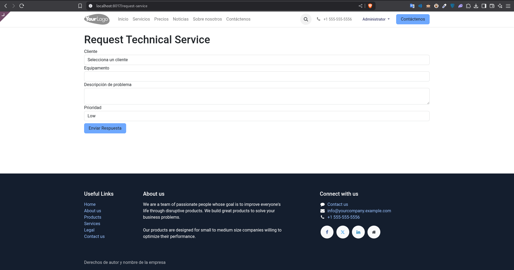
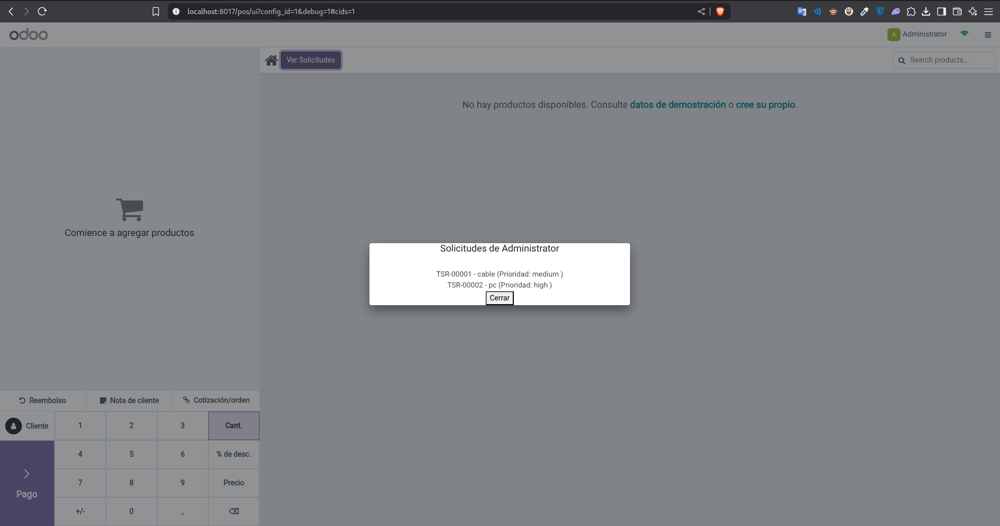

## 📌 Objetivo
Implementar un módulo Odoo para gestionar solicitudes de servicios técnicos con:
- ✅ **Backend**: Modelos, vistas y seguridad  
- 🌐 **Frontend**: Formulario web público  
- 🛒 **POS**: Integración con Punto de Venta  
- 📄 **Reportes**: PDF y emails automáticos  
- 🔄 **API REST** (Bonus)

Modulo:

---

🚀 Funcionalidades Implementadas
Parte 1: Backend
✅ Modelo technical.service.request con:

Campos: name, customer_id, equipment, priority (low/medium/high)

Estados: draft → in_process → done/canceled

Validaciones: fechas y técnico asignado

Parte 2: Frontend
🌐 Formulario Web Público:

Ruta /request-service

Validación JS + Controlador Python

🛒 Extensión POS:

Botón "Ver Solicitudes"

Popup con Owl.js

📄 Reportes:

PDF generado con QWeb

Email automático al cerrar solicitud

Bonus (API REST)
🔒 Endpoint /api/technical-requests:

Autenticación por token

Filtros por estado y prioridad

🧪 Pruebas
Crear solicitud desde backend

Enviar formulario web

Verificar integración POS

Validar PDF y correo electrónico

📬 Contacto

✉️ Email: jmacea.dev@gmail.com

🔗 LinkedIn: [linkedin.com/in/tu-perfil](https://www.linkedin.com/in/jeison-macea-81345b224/)

